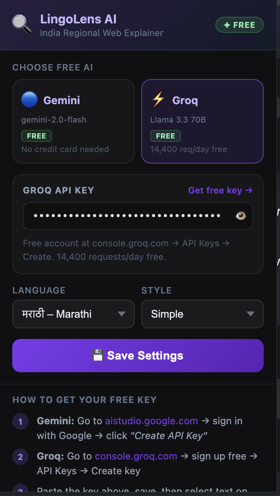
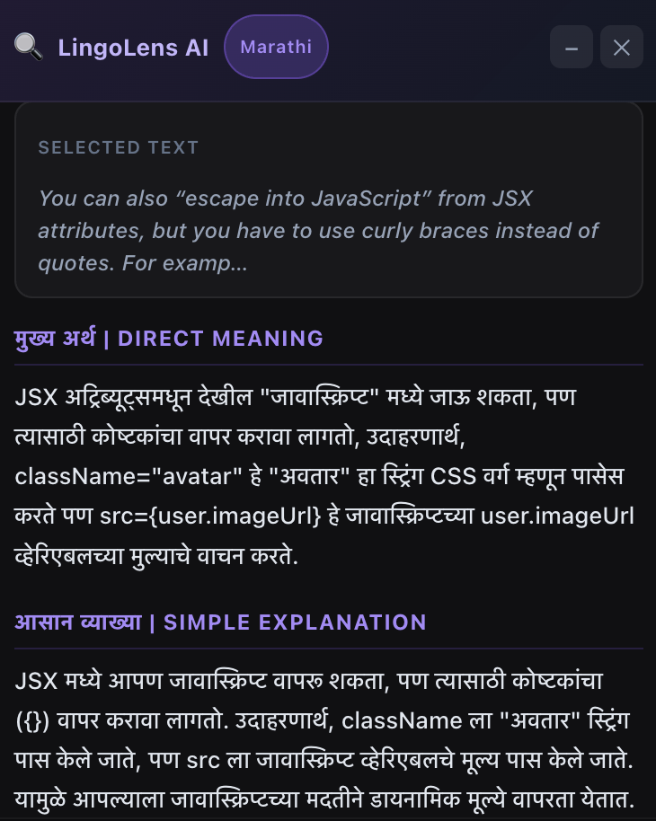
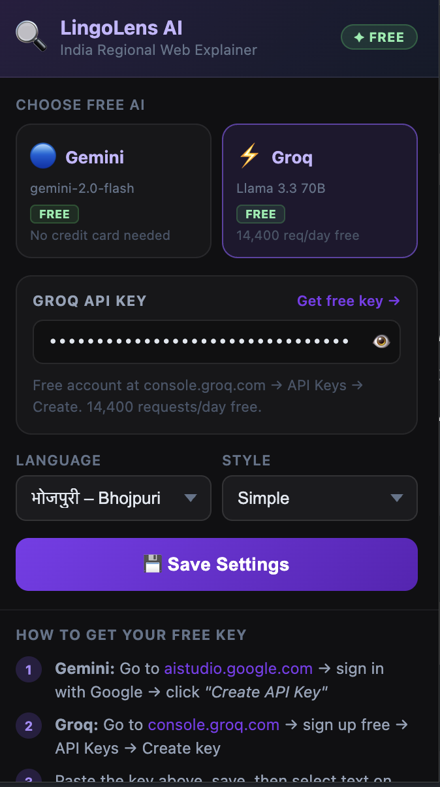
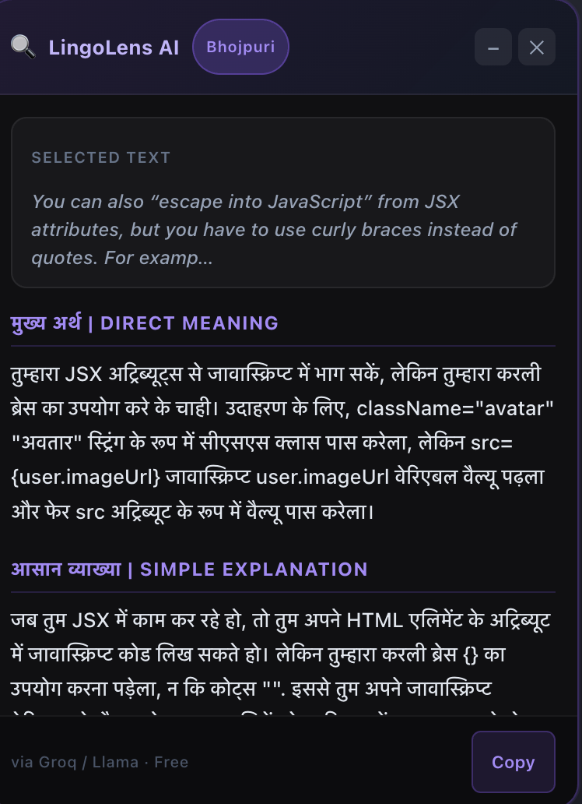

# 🔎 LingoLens AI — India Regional Web Explainer

LingoLens AI is a Chrome Extension that helps users understand any text on the web in **11+ Indian regional languages** using **free AI models**.

Simply select text on any webpage, choose your preferred language, and get instant explanations powered by **Google Gemini** or **Groq (Llama 3.3 70B)**.

<p align="center">
  
  
</p>

---

## ✨ Features

* 🌐 Explain web content in 11+ Indian regional languages
* 🤖 Support for multiple AI providers:

  * Google Gemini 2.0 Flash
  * Groq (Llama 3.3 70B)
* 🔑 Secure API key storage using `chrome.storage.sync`
* ⚡ Automatic content script injection with `chrome.scripting`
* 📌 Draggable floating explanation panel
* 📝 Multiple explanation styles
* 📋 One-click copy functionality
* 🌙 Modern dark-themed interface
* 🔒 No backend required — API keys remain in your browser

---

## 🗣️ Supported Languages

* Hindi
* Marathi
* Bhojpuri
* Bengali
* Tamil
* Telugu
* Kannada
* Malayalam
* Gujarati
* Punjabi
* Odia

---

## 🖼️ Screenshots

### Settings Panel — Marathi

<p align="center">
  
</p>

### Explanation Output — Marathi

<p align="center">
  
</p>

### Settings Panel — Bhojpuri

<p align="center">
  
</p>

### Explanation Output — Bhojpuri

<p align="center">
  
</p>

---

## 🛠️ Tech Stack

* JavaScript
* Chrome Extension Manifest V3
* Chrome Scripting API
* Chrome Storage API
* Google Gemini API
* Groq API (Llama 3.3 70B)

---

## 🚀 Installation

1. Clone the repository:

```bash
git clone https://github.com/darkknightamkit/lingolens-extension.git
```

2. Open Chrome and navigate to:

```text
chrome://extensions/
```

3. Enable **Developer mode**.

4. Click **Load unpacked**.

5. Select the cloned project folder.

6. Open the extension and add your Gemini or Groq API key.

---

## 🔑 Get Free API Keys

### Google Gemini

1. Visit: https://aistudio.google.com/
2. Sign in with your Google account.
3. Click **Create API Key**.

### Groq

1. Visit: https://console.groq.com/
2. Create a free account.
3. Navigate to **API Keys**.
4. Click **Create Key**.

---

## 💡 How It Works

1. Select any text on a webpage.
2. Open LingoLens AI.
3. Choose your preferred language and explanation style.
4. Select an AI provider.
5. Receive an instant explanation in your chosen language.

---

## 🔒 Privacy

* API keys are stored securely using `chrome.storage.sync`.
* Selected text is sent only to the AI provider you choose.
* No user data is collected, stored, or shared.

---

## 🤝 Contributing

Contributions, issues, and feature requests are welcome.

Feel free to fork the repository and submit a pull request.

---

## 📄 License

This project is licensed under the MIT License.
